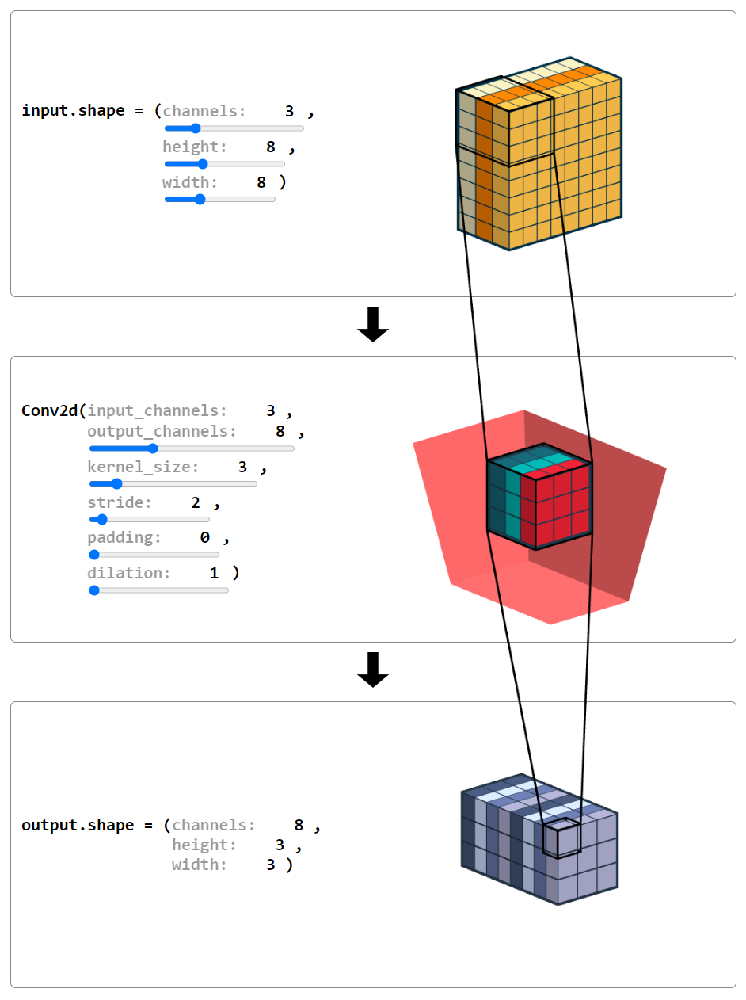

# Convolution Shape Calculator

Access it here: https://zimonitrome.github.io/convolution-shape-calculator/

Webapp used to calculate and visualize the input and output of deep learning layers to easier build models.

Built using [SolidJS](https://github.com/solidjs/solid) and [SVG.js](https://github.com/svgdotjs/svg.js).

Inspired by: https://github.com/madebyollin/convnet-calculator

## ThreeJS resources

* Canvas textures: https://codepen.io/dawken/pen/YzydEza?editors=1000
* Sprite text labels: https://stemkoski.github.io/Three.js/Sprite-Text-Labels.html
